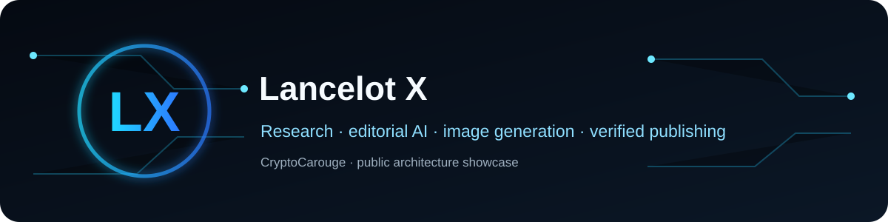
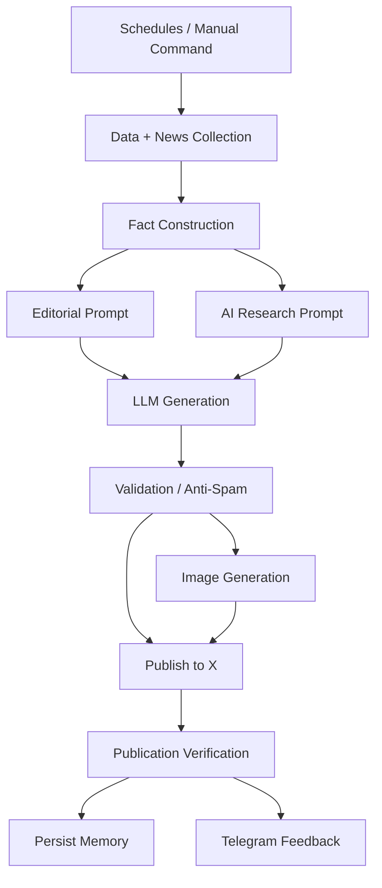

# Lancelot X AI Publishing

**Live project page:** https://cryptocarouge.github.io/projects/lancelot-x-ai-publishing.html

An autonomous research, editorial and publishing pipeline built with n8n.

The private production system combines scheduled editions, live data, LLM-based editorial work, image generation, publication controls and Telegram operations. This repository documents the architecture without exposing production keys, private prompts or account identifiers.

> **Engineering case study:** [architecture decisions, failure modes and privacy boundary](docs/case-study.md)

## What it demonstrates

- Scheduled and manual editorial paths
- Market, macro and RSS/news ingestion
- Fact-building before generation
- Separate editorial and AI-research routes
- LLM-assisted copy generation
- AI image generation
- X media upload and publishing
- Anti-spam and duplicate protection
- Post-publication verification
- Memory written only after confirmed publication
- Telegram commands and operational feedback

## Architecture

## Design choices

Deterministic tasks stay outside the model where possible. Data gathering, routing, anti-spam checks, publication verification and state updates are workflow logic.

AI is used where it materially helps: research synthesis, editorial writing and image generation.

## Security boundary

The public repository excludes OpenAI keys, X OAuth credentials, Telegram credentials/chat IDs, private prompts, account-specific publishing settings, private state and production workflow JSON.

## Status

Public architecture showcase. Production system remains private.
